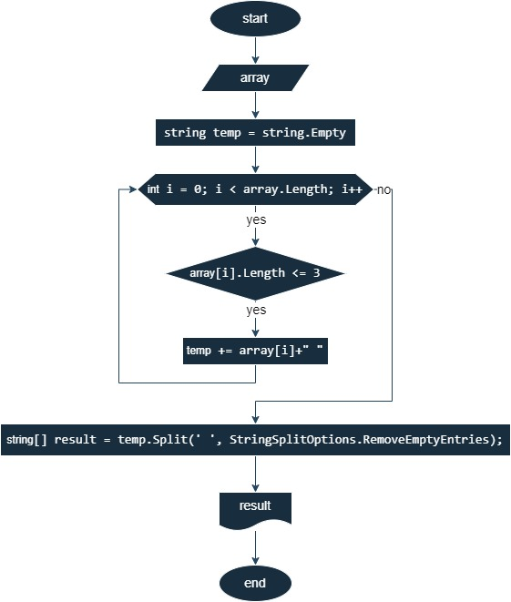

### Для выполнения проверочной работы необходимо:
1. Создать репозиторий на GitHub
2. Нарисовать блок-схему алгоритма (можно обойтись блок-схемой основной содержательной части, если вы выделяете её в отдельный метод)
3. Снабдить репозиторий оформленным текстовым описанием решения (файл README.md)
4. Написать программу, решающую поставленную задачу
5. Использовать контроль версий в работе над этим небольшим проектом (не должно быть так, что всё залито одним коммитом, как минимум этапы 2, 3, и 4 должны быть расположены в разных коммитах)

`Задача`: Написать программу, которая из имеющегося массива строк формирует новый массив из строк, длина которых меньше, либо равна 3 символам. Первоначальный массив можно ввести с клавиатуры, либо задать на старте выполнения алгоритма. При решении не рекомендуется пользоваться коллекциями, лучше обойтись исключительно массивами.
*Примеры*:   
[“Hello”, “2”, “world”, “:-)”] → [“2”, “:-)”]   
[“1234”, “1567”, “-2”, “computer science”] → [“-2”]    

### Решение задач:
1. [Репозиторий на GItHUB](https://github.com/Maxmegapixel/test).
2. Блок-схема алгоритма:    

3. Описание ниже :white_check_mark:    
4. Программа :white_check_mark:    
5. Контроль версий :white_check_mark:    
## Описание решения задачи:
* Создается метод для ввода массива строк с клавиатуры `GetArray`:   
   - В методе снача вводится длина массива _number_ с помощью _Console.ReadLine()_
   - Затем объявлется массив _result_
   - Далее через цикл **for** массив _result_ заполняется с помощью _Console.ReadLine()_
   - Метод возвращает _result_

- Потом пишется метод `GetNew` для формирования нового массив из строк, длина которых меньше, либо равна 3 символам:
    - В качестве аргумента метод принимает массив строк _string[] array_
    - Объявляется строковая переменная _temp_ для хранения промежуточного значения
    - Далее циклом __for__ прогоняется массив _array_ и в строку _temp_ добавляютря строки массива меньшие или равные 3-м символам
    - Затем с помощью метода _Split_ из _temp_ создается массив подстрок и записывается в _result_
    - Метод возвращает _result_
* В конце получается массив строк в помощью метода _GetArray()_, новый массив методом _GetNew()_ и на экран выводятся оба массива.

